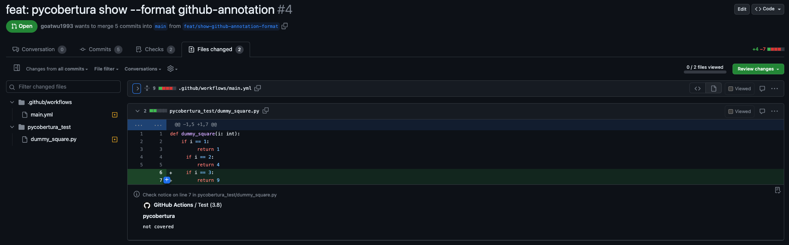
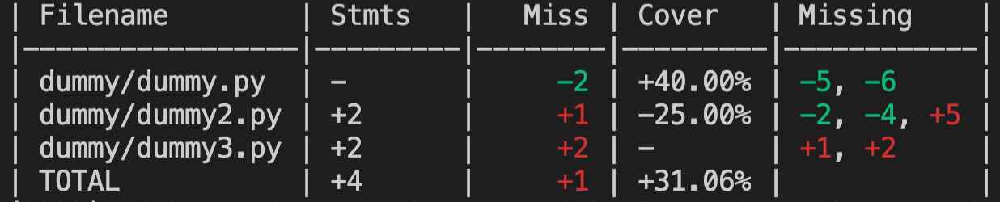
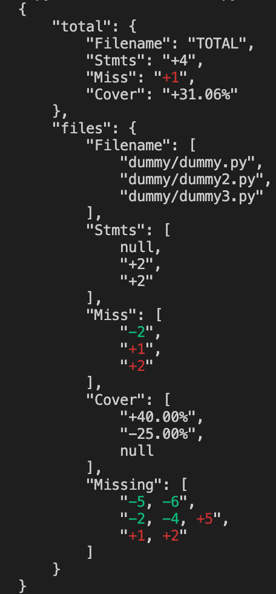
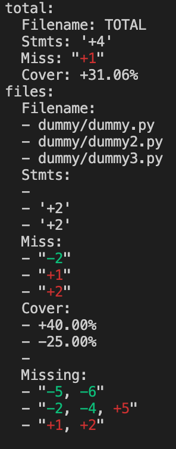
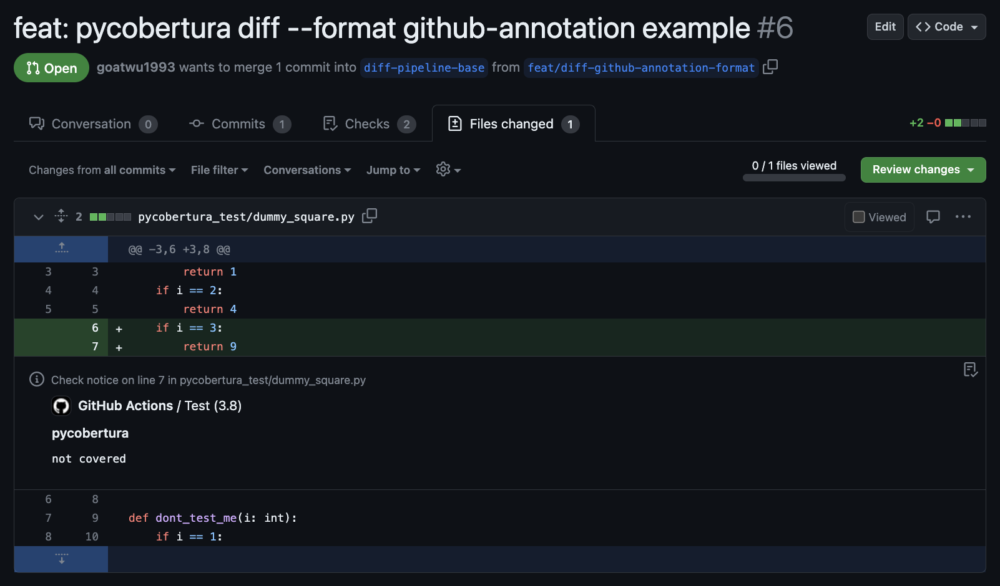

# pycobertura


A code coverage diff tool for Cobertura reports.


[](https://pypi.python.org/pypi/pycobertura)

- [About](#about)
- [Install](#install)
- [CLI usage](#cli-usage)
- [Library usage](#library-usage)
- [How to contribute?](#how-to-contribute)
- [FAQ](#faq)

## About

pycobertura is a generic [Cobertura](http://cobertura.github.io/cobertura/)
report parser. It was also designed to help prevent code coverage from
decreasing with the `pycobertura diff` command: any line changed should be
tested and uncovered changes should be clearly visible without letting legacy
uncovered code get in the way so developers can focus solely on their changes.

Features:

* show coverage summary of a cobertura file
* output in plain text or HTML
* compare two cobertura files and show changes in coverage
* colorized diff output
* diff exit status of non-zero if coverage worsened or if any changes were left uncovered
* fail based on uncovered lines rather than on decrease of coverage rate
  ([see why](#why-is-the-number-of-uncovered-lines-used-as-the-metric-to-check-if-code-coverage-worsened-rather-than-the-line-rate))

NOTE: The API is unstable any may be subject to changes until it reaches 1.0.

## Install

```shell
pip install pycobertura
```

## CLI usage

pycobertura provides a command line interface to report on coverage files.

### Help commands

Different help screens are available depending on what you need help about.

```shell
$ pycobertura --help
Usage: pycobertura [OPTIONS] COMMAND [ARGS]...

Options:
  --help  Show this message and exit.

Commands:
  diff  The diff command compares and shows the changes between two...
  show  show coverage summary of a Cobertura report
```

```shell
pycobertura show --help
```

```shell
pycobertura diff --help
```

### Command `show`

The `show` command displays the report summary of a coverage file.

```shell
$ pycobertura show coverage.xml
Filename                     Stmts    Miss  Cover    Missing
-------------------------  -------  ------  -------  ---------
pycobertura/__init__.py          1       0  100.00%
pycobertura/cli.py              18       0  100.00%
pycobertura/cobertura.py        93       0  100.00%
pycobertura/reporters.py       129       0  100.00%
pycobertura/utils.py            12       0  100.00%
TOTAL                          253       0  100.00%
```

*NOTE*: For the csv format we chose as default delimiter the semicolon, because the common is used internally in the "Missing" column,
therefore the "," delimiter might lead to problems when rendering the csv in an editor.
```shell
$ pycobertura show --format csv coverage.xml --delimiter ";"
Filename;Stmts;Miss;Cover;Missing
pycobertura/__init__.py;2;0;100.00%;
pycobertura/cli.py;132;88;33.33%;274-3758
pycobertura/cobertura.py;216;35;83.80%;423, 648-696
pycobertura/filesystem.py;91;6;93.41%;343-625
pycobertura/reporters.py;214;110;48.60%;291, 295-3284
pycobertura/utils.py;122;15;87.70%;38, 262-486
pycobertura/templates/__init__.py;0;0;100.00%;
pycobertura/templates/filters.py;17;10;41.18%;261-544
TOTAL;794;264;66.75%;
```

```shell
$ pycobertura show --format markdown coverage.xml 
| Filename                          |   Stmts |   Miss | Cover   | Missing            |
|-----------------------------------|---------|--------|---------|--------------------|
| pycobertura/__init__.py           |       2 |      0 | 100.00% |                    |
| pycobertura/cli.py                |     132 |     88 | 33.33%  | 274-3758           |
| pycobertura/cobertura.py          |     216 |     35 | 83.80%  | 423, 648-696       |
| pycobertura/filesystem.py         |      91 |      6 | 93.41%  | 343-625            |
| pycobertura/reporters.py          |     222 |    114 | 48.65%  | 286, 290, 331-4065 |
| pycobertura/utils.py              |     122 |     15 | 87.70%  | 38, 262-486        |
| pycobertura/templates/__init__.py |       0 |      0 | 100.00% |                    |
| pycobertura/templates/filters.py  |      17 |     10 | 41.18%  | 261-544            |
| TOTAL                             |     802 |    268 | 66.58%  |                    |
```

The following is a screenshot of the HTML version of another coverage file
which also include the source code with highlighted source code to indicate
whether lines were covered (green) or not (red).

```shell
pycobertura show --format html --output coverage.html coverage.xml
```


The following shows how to generate a JSON version of another coverage file.

```shell
$ pycobertura show --format json --output coverage.json tests/cobertura.xml
{
    "files": [
        {
            "Filename": "Main.java",
            "Stmts": 15,
            "Miss": 0,
            "Cover": "100.00%",
            "Missing": ""
        },
        {
            "Filename": "search/BinarySearch.java",
            "Stmts": 12,
            "Miss": 1,
            "Cover": "91.67%",
            "Missing": "24"
        },
        {
            "Filename": "search/ISortedArraySearch.java",
            "Stmts": 0,
            "Miss": 0,
            "Cover": "100.00%",
            "Missing": ""
        },
        {
            "Filename": "search/LinearSearch.java",
            "Stmts": 7,
            "Miss": 2,
            "Cover": "71.43%",
            "Missing": "19-24"
        }
    ],
    "total": {
        "Filename": "TOTAL",
        "Stmts": 34,
        "Miss": 3,
        "Cover": "90.00%"
    }
}
```

```shell
$ pycobertura show --format yaml --output coverage.yaml tests/cobertura.xml
files:
- Filename: Main.java
  Stmts: 15
  Miss: 0
  Cover: 100.00%
  Missing: ''
- Filename: search/BinarySearch.java
  Stmts: 12
  Miss: 1
  Cover: 91.67%
  Missing: '24'
- Filename: search/ISortedArraySearch.java
  Stmts: 0
  Miss: 0
  Cover: 100.00%
  Missing: ''
- Filename: search/LinearSearch.java
  Stmts: 7
  Miss: 2
  Cover: 71.43%
  Missing: 19-24
total:
  Filename: TOTAL
  Stmts: 34
  Miss: 3
  Cover: 90.00%

```

The following shows how to generate GitHub annotations given a coverage file.

```shell
$ pycobertura show --format github-annotation tests/cobertura.xml
::notice file=dummy/dummy.py,line=5,endLine=6,title=pycobertura::not covered
::notice file=dummy/dummy4.py,line=1,endLine=6,title=pycobertura::not covered
```

If you run it in GitHub Actions/Apps, the above log generates check annotations.



### Command `diff`

You can also use the `diff` command to show the difference between two coverage
files. To properly compute the `Missing` column, it is necessary to provide the
source code that was used to generate each of the passed Cobertura reports
([see why](#why-do-i-need-to-provide-the-path-to-the-source-code-directory)).

```shell
$ pycobertura diff coverage.old.xml coverage.new.xml --source1 old_source/ --source2 new_source/
Filename          Stmts    Miss    Cover     Missing
----------------  -------  ------  --------  ---------
dummy/dummy.py    -        -2      +50.00%   -2, -5
dummy/dummy2.py   +2       -       +100.00%
TOTAL             +2       -2      +50.00%
```

The column `Missing` will show line numbers prefixed with either a plus sign
`+` or a minus sign `-`. When prefixed with a plus sign, the line was
introduced as uncovered and is shown in red, when prefixed as a minus sign, the
line is no longer uncovered and is rendered in green.

Analogously you can also show the diff in csv format with the option to define a delimiter (\t should also work here) via:

```shell
pycobertura diff tests/dummy.source1/coverage.xml tests/dummy.source2/coverage.xml --format csv --delimiter ";"
```


*NOTE*: The default delimiter is semicolon (;). The delimiters comma (,) and newline (/n) are *very risky* to use and are not supported by this library. The comma delimiter is used in the "Missing" column in the list datastructure to separate the different items. Therefore the "," delimiter might lead to problems when rendering the csv in an editor. As a missing value in csv corresponds to an empty value, the newline delimiter can as well lead to problems when rendering the csv in an editor.

Analogously you can also show the diff in markdown format via:

```shell
pycobertura diff --format markdown tests/dummy.source1/coverage.xml tests/dummy.source2/coverage.xml
```

This will lead to the following output


This screenshot shows how the HTML output only applies coverage highlighting to
the parts of the code where the coverage has changed (from covered to
uncovered, or vice versa).

```shell
pycobertura diff --format html --output coverage.html ./master/coverage.xml ./myfeature/coverage.xml
```


This screenshot shows how the JSON output only applies coverage highlighting to
the parts of the code where the coverage has changed (from covered to
uncovered, or vice versa).

```shell
pycobertura diff --format json tests/dummy.source1/coverage.xml tests/dummy.source2/coverage.xml
```



This screenshot shows how the YAML output only applies coverage highlighting to
the parts of the code where the coverage has changed (from covered to
uncovered, or vice versa).

```shell
pycobertura diff --format yaml tests/dummy.source1/coverage.xml tests/dummy.source2/coverage.xml
```



The following shows how to generate GitHub annotations given a coverage file.

```shell
$ pycobertura diff --format github-annotation tests/dummy.source1/coverage.xml tests/dummy.source2/coverage.xml
::notice file=dummy/dummy2.py,line=5,endLine=5,title=pycobertura::not covered
::notice file=dummy/dummy3.py,line=1,endLine=2,title=pycobertura::not covered
```

If you run it in GitHub Actions/Apps, the above log generates check annotations.




### Option to exclude files via --ignore-regex-option
You can specify the `--ignore-regex` option to exclude files that have a certain pattern either by specifying the path to a `.gitignore` file or by entering a Python regex.
Examples:
```
pycobertura show tests/cobertura.xml
Filename                          Stmts    Miss  Cover    Missing
------------------------------  -------  ------  -------  ---------
Main.java                            15       0  100.00%
search/BinarySearch.java             12       1  91.67%   24
search/ISortedArraySearch.java        0       0  100.00%
search/LinearSearch.java              7       2  71.43%   19-24
TOTAL                                34       3  90.00%
```
```
pycobertura show tests/cobertura.xml --ignore-regex ".*Search"
Filename      Stmts    Miss  Cover    Missing
----------  -------  ------  -------  ---------
Main.java        15       0  100.00%
TOTAL            34       3  90.00%
```
> NOTE: Putting just a `*`, e.g. "*Search" above will lead to an error, you need to really follow Python regex conventions to use this option.
You can also specify a `.testgitignore` with the following content:
```
# Test file for ignore regexes

**/__pycache__
**/dummy*

*.xml

**/*Search*
```
and then use
```
pycobertura show tests/cobertura.xml --ignore-regex "tests/.testgitignore"
Filename      Stmts    Miss  Cover    Missing
----------  -------  ------  -------  ---------
Main.java        15       0  100.00%
TOTAL            34       3  90.00%
```
The same will also work for `diff` commands.

#### `diff` exit codes

Upon exit, the `diff` command may return various exit codes:

* 0: all changes are covered, no new uncovered statements have been introduced
* 1: some exception occurred (likely due to inappropriate usage or a bug in pycobertura)
* 2: the changes worsened the overall coverage
* 3: the changes introduced uncovered statements but the overall coverage is still better than before

You can capture the exit code by using the `$?` syntax from your shell:

```bash
pycobertura ...
PYCOBERTURA_EXIT_CODE=$?
echo $PYCOBERTURA_EXIT_CODE
```

## Library usage

Using it as a library in your Python application is easy:

```python
from pycobertura import Cobertura
cobertura = Cobertura('coverage.xml')

cobertura.version == '4.0.2'
cobertura.line_rate() == 1.0  # 100%
cobertura.files() == [
    'pycobertura/__init__.py',
    'pycobertura/cli.py',
    'pycobertura/cobertura.py',
    'pycobertura/reporters.py',
    'pycobertura/utils.py',
]
cobertura.line_rate('pycobertura/cli.py') == 1.0

from pycobertura import TextReporter
tr = TextReporter(cobertura)
tr.generate() == """\
Filename                     Stmts    Miss  Cover    Missing
-------------------------  -------  ------  -------  ---------
pycobertura/__init__.py          1       0  100.00%
pycobertura/cli.py              18       0  100.00%
pycobertura/cobertura.py        93       0  100.00%
pycobertura/reporters.py       129       0  100.00%
pycobertura/utils.py            12       0  100.00%
TOTAL                          253       0  100.00%"""

from pycobertura import TextReporterDelta

coverage1 = Cobertura('coverage1.xml')
coverage2 = Cobertura('coverage2.xml')
delta = TextReporterDelta(coverage1, coverage2)
delta.generate() == """\
Filename          Stmts    Miss    Cover     Missing
----------------  -------  ------  --------  ---------
dummy/dummy.py    -        -2      +50.00%   -2, -5
dummy/dummy2.py   +2       -       +100.00%
TOTAL             +2       -2      +50.00%"""
```

## How to contribute?

Found a bug/typo? Got a patch? Have an idea? Please use Github issues or fork
pycobertura and submit a pull request (PR). All contributions are welcome!

If you submit a PR:

* ensure the description of your PR illustrates your changes clearly by showing
  what the problem was and how you fixed it (before/after)
* make sure your changes are covered with one or more tests
* add a descriptive note in the CHANGES file under the `Unreleased` section
* update the README accordingly if your changes outdate the documentation
* make sure all tests are passing using `tox`

```shell
pip install tox
tox
```

## FAQ

### How does pycobertura work?

Pycobertura takes two different Cobertura reports and compares them line by
line. If the coverage status of a line changed from covered to uncovered or
vice versa, then pycobertura will report it. Sometimes you have no code changes
at all, the only changes were to add more tests and pycobertura will show you
the progress.

Pycobertura was initially designed as a general purpose Cobertura parser and
can generate a summary table for a single Cobertura file (the `show` command).

### I only have one Cobertura report, can I just see my uncovered changes?

Yes. All you have to do is pass your same coverage report twice and provide the
path to the two different code bases:

```shell
pycobertura diff coverage.xml coverage.xml --source1 master/ --source2 myfeature/
```

But keep in mind that this will not show you if your changes have introduced a
drop in coverage elsewhere in the code base.

### Why doesn't pycobertura use git to diff the source given revision SHAs rather than passing paths to the source code?

Because we would have to support N version control systems (VCS). It is easy
enough to generate a directory that contains the source code at a given commit
or branch name that it's not a top priority for pycobertura to be VCS-aware:

```shell
git archive --prefix=source1/ ${BRANCH_OR_COMMIT1} | tar -xf -
git archive --prefix=source2/ ${BRANCH_OR_COMMIT2} | tar -xf -
pycobertura diff --source1 source1/ --source2 source2/ coverage1.xml coverage2.xml -o output.html
rm -rf source1/ source2/
```

Mercurial has `hg archive` and Subversion has `svn export`. These are simple
pre-steps to running `pycobertura diff`.

Also, the code repository may not always be available at the time pycobertura
is run. Typically, in Continuous Delivery pipelines, only
[artifacts](http://en.wikipedia.org/wiki/Artifact_%28software_development%29)
are available.

### Why do I need to provide the path to the source code directory?

With the command `pycobertura show`, you don't need to provide the source code
directory, unless you want the HTML output which will conveniently render the
highlighted source code for you.

But with `pycobertura diff`, if you care about *which* lines are covered or
uncovered (and not just a global count), then you will need to provide the
source for *each* of the reports.

To better understand why, let's assume we have 2 Cobertura reports with the
following info:

Report A:

```shell
line 1, hit
line 2, miss
line 3, hit
```

and Report B:

```shell
line 1, hit
line 2, miss
line 3, hit
line 4, miss
line 5, hit
```

How can you tell which lines need to be highlighted? Naively, you'd assume that
lines 4-5 were added and these should be the highlighted lines, the ones part
of your coverage diff. Well, that doesn't quite work.

The code for Report A is:

```python
if foo is True:  # line 1
    total += 1   # line 2
return total     # line 3
```

The code for Report B is:

```python
if foo is False:   # line 1  # new line
    total -= 1     # line 2  # new line
elif foo is True:  # line 3  # modified line
    total += 1     # line 4, unchanged
return total       # line 5, unchanged
```

The code change are lines 1-3 and these are the ones you want to highlight.
Lines 4-5 don't need to be highlighted (unless coverage status changed
in-between).

So, to accurately highlight the lines that have changed, the coverage reports
alone are not sufficient and this is why you need to provide the path to the
source that was used to generate each of the Cobertura reports and diff them to
see which lines actually changed to report accurate coverage.

### When should I use pycobertura?

pycobertura was built as a tool to educate developers about the testing culture
in such way that any code change should have one or more tests along with it.

You can use pycobertura in your Continuous Integration (CI) or Continuous
Delivery (CD) pipeline which would fail a build if the code changes worsened
the coverage. For example, when a pull request is submitted, the new code
should have equal or better coverage than the branch it's going to be merged
into. Or if code navigates through a release pipeline and the new code has
worse coverage than what's already in Production, then the release is aborted.

When a build is triggered by your CI/CD pipeline, each testing stage would
typically store an
[artifact](http://en.wikipedia.org/wiki/Artifact_%28software_development%29) of
the source code and another one of the Cobertura report. An extra stage in the
pipeline could ensure that the coverage did not worsen. This can be done by
retrieving the artifacts of the current build as well as the "target" artifacts
(code and Cobertura report of Production or target branch of a pull request).
Then `pycobertura diff` will take care of failing the build if the coverage
worsened (return a non-zero exit code) and then the pycobertura report can be
published as an artifact to make it available to developers to look at.

The step could look like this:

```shell
# Download artifacts of current build
curl -o coverage.${BUILD_ID}.xml https://ciserver/artifacts/${BUILD_ID}/coverage.xml
curl -o source.${BUILD_ID}.zip https://ciserver/artifacts/${BUILD_ID}/source.zip

# Download artifacts of already-in-Prod build
curl -o coverage.${PROD_BUILD}.xml https://ciserver/artifacts/${PROD_BUILD}/coverage.xml
curl -o source.${PROD_BUILD}.zip https://ciserver/artifacts/${PROD_BUILD}/source.zip

unzip source.${BUILD_ID}.zip -d source.${BUILD_ID}
unzip source.${PROD_BUILD}.zip -d source.${PROD_BUILD}

# Compare
pycobertura diff --format html \
                 --output pycobertura-diff.${BUILD_ID}.html \
                 --source1 source.${PROD_BUILD} \
                 --source2 source.${BUILD_ID} \
                 coverage.${PROD_BUILD}.xml \
                 coverage.${BUILD_ID}.xml

# Upload the pycobertura report artifact
curl -F filedata=@pycobertura-diff.${BUILD_ID}.html http://ciserver/artifacts/${BUILD_ID}/
```

### Why is the number of uncovered lines used as the metric to check if code coverage worsened rather than the line rate?

The line rate (percentage of covered lines) can legitimately go down for a
number of reasons. To illustrate, suppose we have this code coverage report for
version A of our code:

```shell
line 1: hit
line 2: hit
line 3: miss
line 4: hit
line 5: hit
```

Here, the line rate is 80% and uncovered lines is 1 (miss). Later in version B
of our code, we legitimately delete a covered line and the following coverage
report is generated:

```shell
line 1: hit
### line deleted ###
line 2: miss
line 3: hit
line 4: hit
```

The line rate decreased from 80% to 75% but uncovered lines is still at 1. In
this case, failing the build based on line rate is inappropriate, thus making
the line rate the wrong metric to look at when validating coverage.

The basic idea is that a code base may have technical debt of N uncovered lines
and you want to prevent N from ever going up.

### pycobertura sounds cool, but how to I generate a Cobertura file?

Depending on your programing language, you need to find a tool that measures
code coverage and generates a Cobertura report which is an XML representation
of your code coverage results.

In Python, [coverage.py](http://nedbatchelder.com/code/coverage/) is a great
tool for measuring code coverage and plugins such as
[pytest-cov](https://pypi.python.org/pypi/pytest-cov) for
[pytest](http://pytest.org/latest/) and
[nosexcover](https://pypi.python.org/pypi/nosexcover) for
[nose](https://nose.readthedocs.org/en/latest/) are available to generate
Cobertura reports while running tests.

[Istanbul](https://github.com/gotwarlost/istanbul) can generate
Cobertura reports for Javascript and also has plugins for
[CoffeeScript](https://github.com/benbria/coffee-coverage) if that is your
cup of tea.

Cobertura is a very common file format available in many testing tools for
pretty much all programing languages. pycobertura is language agnostic and
should work with reports generated by tools in any language. But it was mostly
developed and tested against reports generated with the `pytest-cov` plugin in
Python. If you see issues, please [create a
ticket](https://github.com/SurveyMonkey/pycobertura/issues).

## Logo credit

The pycobertura logo, Aysha, was graciously
[donated](https://github.com/arasatasaygin/openlogos/issues/19) by
[Open Logos](http://openlogos.org/). 🙇‍ Check them out!
